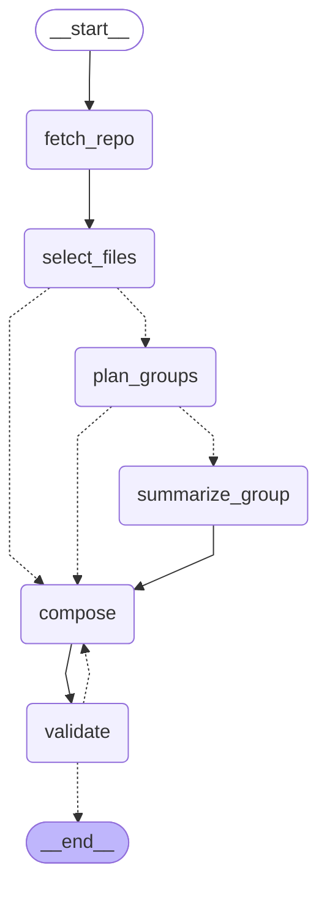

# Diagrama de Arquitectura de LangGraph — CodeScribe AI

> Grafo de orquestación stateful para el análisis arquitectónico y generación de documentación técnica.

```mermaid
---
config:
  flowchart:
    curve: linear
---
graph TD;
	__start__([<p>__start__</p>]):::first
	fetch_repo(fetch_repo)
	select_files(select_files)
	plan_groups(plan_groups)
	summarize_group(summarize_group)
	compose(compose)
	validate(validate)
	__end__([<p>__end__</p>]):::last
	__start__ --> fetch_repo;
	compose --> validate;
	fetch_repo --> select_files;
	plan_groups -.-> compose;
	plan_groups -.-> summarize_group;
	select_files -.-> compose;
	select_files -.-> plan_groups;
	summarize_group --> compose;
	validate -.-> __end__;
	validate -.-> compose;
	classDef default fill:#f2f0ff,line-height:1.2
	classDef first fill-opacity:0
	classDef last fill:#bfb6fc

```
